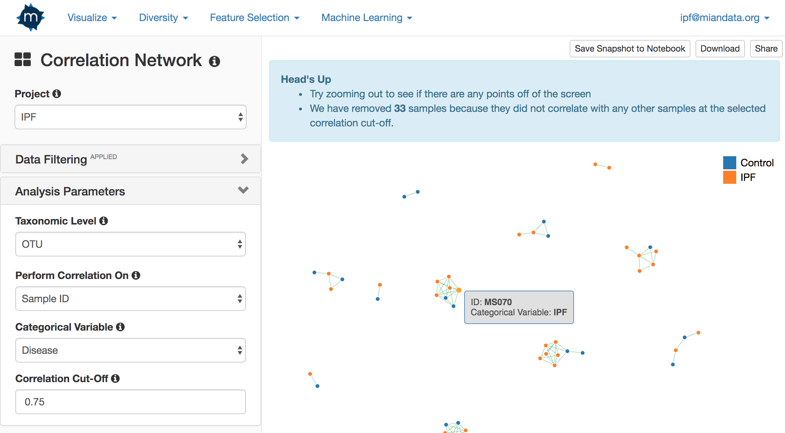

# Correlation Network

### Used For

* Creating a co-correlation network that shows the most positively and negatively correlated samples or taxonomic groups/OTUs \(grouped at the indicated taxonomic level\). Each link has a value between -1 and 1 inclusive

### Visualization Parameters

#### Taxonomic Level

The taxonomic level to aggregate the OTUs at. 

#### Perform Correlation On

Indicate whether to create a network based on the correlations between samples or between taxonomic groups/OTUs.

#### Categorical Variable

Create comparative sample groups based on categorical variables uploaded in the metadata file. 

Optionally create a categorical variable from a quantitative variable by using the Quantile Range feature on the Projects home page. 

Each sample group is assigned its own color.

#### Correlation Cut-Off

Determines when to draw a correlation line between two nodes in the network. This cutoff is based on the absolute value of the Pearson product-moment correlation coefficient.

### Interactive Elements

* Hover over each point to determine the sample ID and corresponding sample group
* Hover over each link to determine the correlation strength
* Drag the network to rearrange

### Additional Features

* **Save Snapshot**: Save the visualization to the experiment notebook
* **Download**: Downloads the visualization as a PNG file
* **Share**: Creates a shareable link that allows you to share the visualization with others

